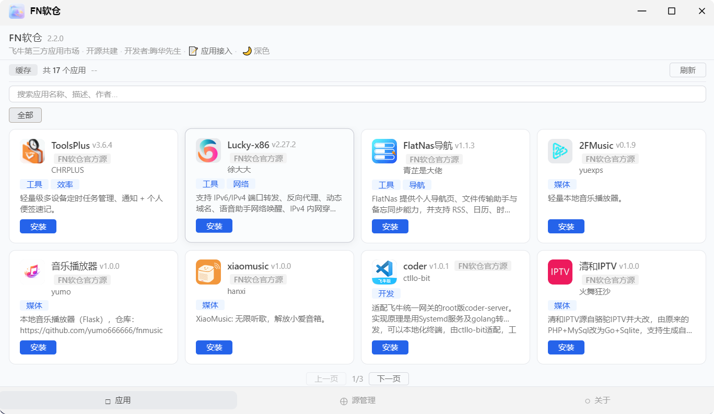
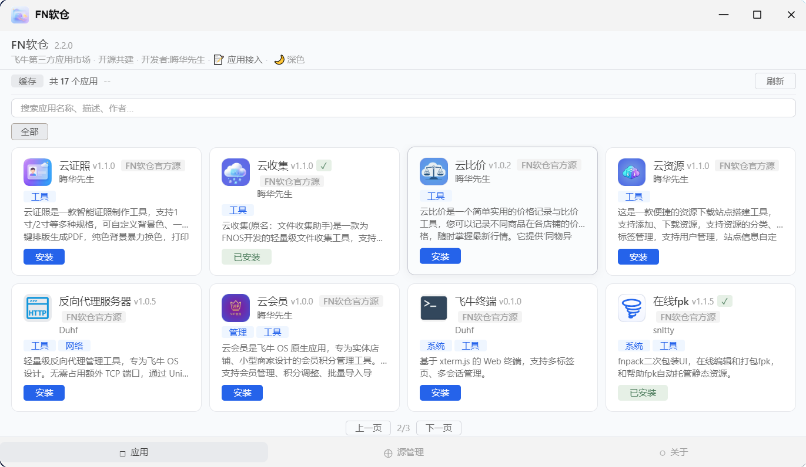
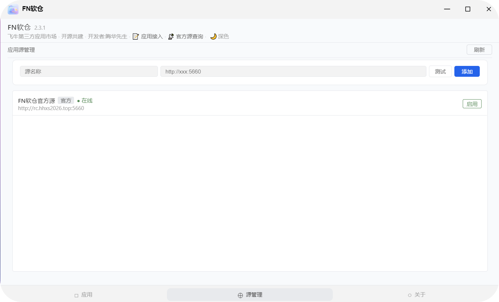

# FN软仓客户端

[](https://gitee.com/hhxs2025/fn-appstores)
[]()
[]()

---

## 📖 项目简介

FN软仓是飞牛OS上的第三方应用商店客户端，支持**多软件源聚合**。用户可自由添加自托管服务端地址，安装、体验飞牛官方应用中心没有的其他三方应用。

| 链接 | 说明 |
| :--- | :--- |
| **客户端项目地址** | [https://gitee.com/hhxs2025/fn-appstores](https://gitee.com/hhxs2025/fn-appstores) |
| **服务端镜像拉取** | `docker pull ccr.ccs.tencentyun.com/hhxs2025/fn-appstores-server:2.4.1` |

---

## 🖼️ 界面预览

| 应用列表 | 应用详情 | 源管理 |
| :---: | :---: | :---: |
|  |  |  |

---

## ✨ 核心功能

| 功能模块 | 说明 |
| :--- | :--- |
| **多源应用聚合** | 从所有启用的源拉取应用列表，自动去重（保留较新版本），卡片显示来源 |
| **软件源管理** | 添加/删除/启用/禁用软件源，源状态缓存 5 分钟，页面秒开 |
| **一键安装/更新** | 支持安装向导，WebSocket 实时推送下载进度 |
| **公告板** | 多源轮询拉取公告，支持 HTML 渲染 |
| **来源标识** | 每个应用卡片显示实际来源（官方源或三方源名称），来源透明可追溯 |
| **深色/浅色主题** | 一键切换，偏好保存至浏览器 |
| **中继环境适配** | API 地址动态适配 `window.location.origin`，无需额外反代 |

> **2.3.2+ 配合服务端 2.4.0 使用**，支持树状聚合架构，官方源可聚合三方源应用，用户无需自行添加三方源即可发现更多应用。

---

## 📖 使用指南

### 浏览应用

- 首页默认展示全部应用
- 使用顶部分类标签快速筛选
- 在搜索框输入关键词查找特定应用
- 应用卡片显示来源标签，便于了解应用来源

### 安装应用

1. 点击应用卡片进入详情页
2. 点击「安装」按钮
3. 如应用有向导，填写配置项后确认
4. 等待进度条完成，自动刷新列表

### 更新应用

- 已安装应用有新版本时，卡片显示「更新」按钮
- 点击「更新」，自动下载新版并安装

### 管理软件源

1. 点击底部「源管理」Tab
2. 查看所有已配置的源及其状态
3. 点击「添加源」，填写名称和地址
4. 点击「测试」验证连通性，确认后添加
5. 可随时启用/禁用或删除自定义源（官方源不可删除）

### 查看公告

- 点击底部「关于」Tab
- 公告板展示服务端下发的公告内容，支持 HTML 格式

---

## 📜 版本历程

```
2.1.1 ──► 2.2.0-beta ──► 2.2.0 ──► 2.2.1 ──► 2.2.2 ──► 2.2.3 ──► 2.3.0   
──► 2.3.1 ──► 2.3.2──► 2.3.3──► 2.3.4──► 2.4.0──► 2.4.1
```

| 版本 | 主要更新 |
| :--- | :--- |
| **v2.1.1** | 单一官方源，基础安装功能 |
| **v2.2.0-beta** | 多源管理初版（添加/删除/启用/禁用） |
| **v2.2.0** | 公告板 + 应用接入链接 |
| **v2.2.1** | 飞牛官方中继适配（`window.location.origin`） |
| **v2.2.2** | 源状态缓存 5 分钟 + 多源公告适配 |
| **v2.2.3** | 精简为单官方源，地址迁移至 `rc.hhxs2026.top:5660` |
| **v2.3.0** | 应用卡片新增下载统计显示功能，公告板改为支持 HTML |
| **v2.3.1** | 修复内含向导的应用安装向导环境变量字段命名不规范而导致的安装失败的问题及其他 bug 【基本稳定版】|
| **v2.3.2** | 修复三方源应用来源标签显示为"FN软仓官方源"的问题，应用来源标识优化,保留服务端返回的来源信息 |
| **v2.3.3** | 修复安装向导中占位符未替换问题,提升了带向导应用(如Lucky)的安装成功率,优化向导界面的提示信息显示 |
| **v2.3.4** | 关于页公告板内容推送功能升级为关于页整个页面的自定义功能 |
| **v2.4.0** | 关于页自定义功能下notice.json编辑简化(升级次版本号以便与服务端一致) |
| **v2.4.1** | 轮播图手动切换 + 状态筛选独立行 + 富文本支持 + 公告超链接 |
---

## ❓ 常见问题

<details>
<summary><b>打开软仓后一直显示“加载中”？</b></summary>

1. 检查飞牛设备网络是否正常
2. 尝试点击右上角「刷新」按钮
3. 检查客户端日志：`/vol*/@appdata/fn-appstores-client/app.log`
</details>

<details>
<summary><b>应用列表加载慢？</b></summary>

首次加载需从服务端拉取数据，受网络影响。后续访问会使用缓存，速度会明显提升。
</details>

<details>
<summary><b>截图不显示？</b></summary>

1. 确认服务端 `previews/{app_id}/` 目录下有截图文件
2. 文件命名应为 `1.PNG`、`2.PNG`（大小写敏感）
3. 确认服务端地址可正常访问
</details>

<details>
<summary><b>安装失败？</b></summary>

1. 确认飞牛系统有足够的存储空间
2. 检查服务端 `apps/` 目录下是否存在对应的 `.fpk` 文件
3. 查看 `app.log` 日志获取详细错误信息
</details>

<details>
<summary><b>三方源应用来源标签显示为“FN软仓官方源”？</b></summary>

请升级客户端到2.3.2 及以上版本，并确保服务端为2.4.0 及以上版本。客户端会正确保留服务端返回的来源信息。
</details>

---

## 👨‍💻 开发者信息

| 项目 | 信息 |
| :--- | :--- |
| **作者** | 晦华先生 |
| **联系方式** | 2303537063@qq.com |
| **开源地址** | [https://gitee.com/hhxs2025/fn-appstores](https://gitee.com/hhxs2025/fn-appstores) |

---

## 🤝 参与共建

欢迎开发者自托管服务端接入 FN软仓生态，或为现有应用提供更新维护。如有疑问请联系作者。
